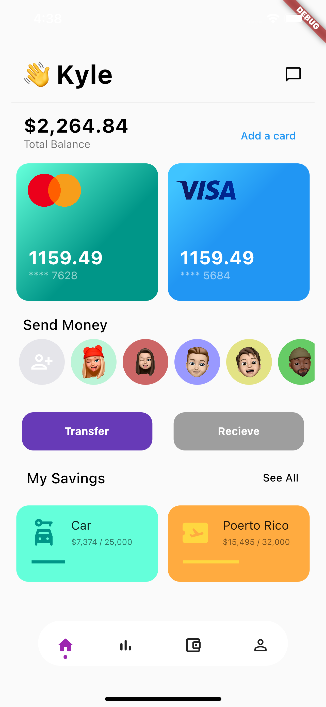
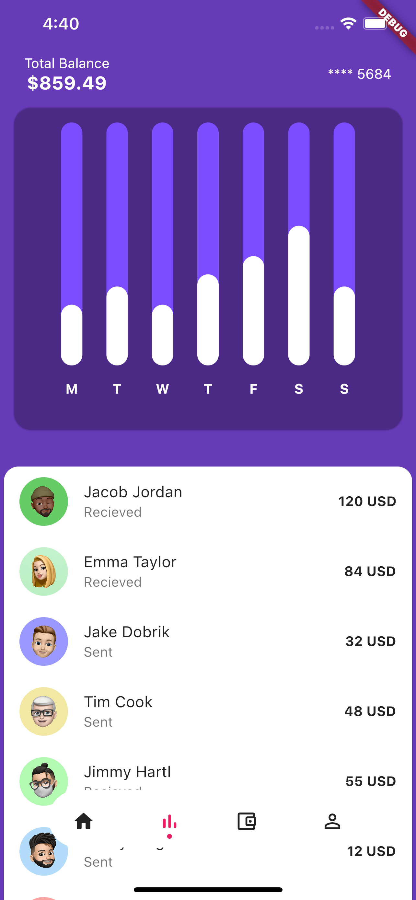

# flutter-walletui
speed coding.
all assets including .psd files are included in the `/aseets` folder.

&nbsp;&nbsp;&nbsp;&nbsp;&nbsp;&nbsp;&nbsp;&nbsp;

# dependencies used
https://github.com/imaNNeoFighT/fl_chart
https://github.com/haptome/dot_navigation_bar